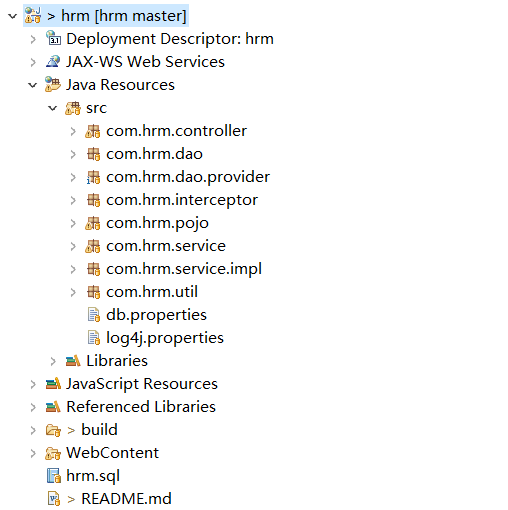
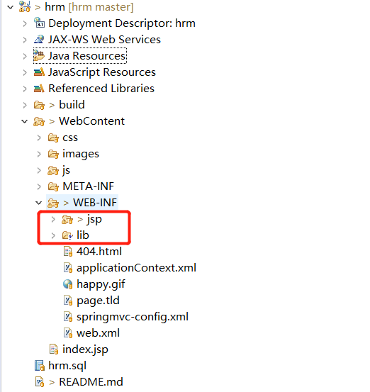
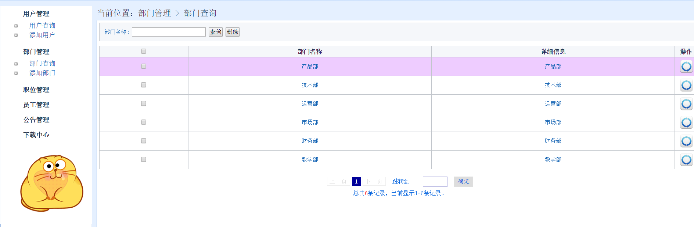
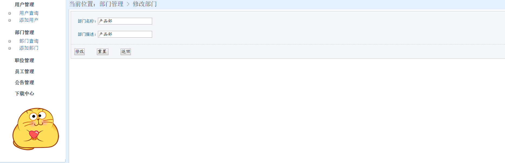
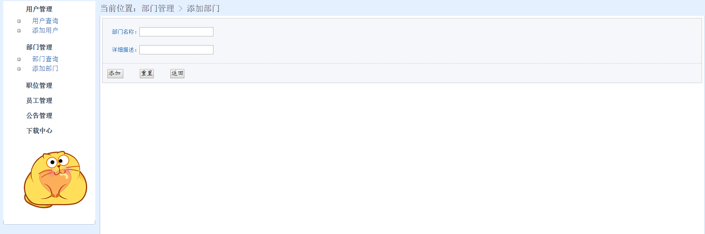
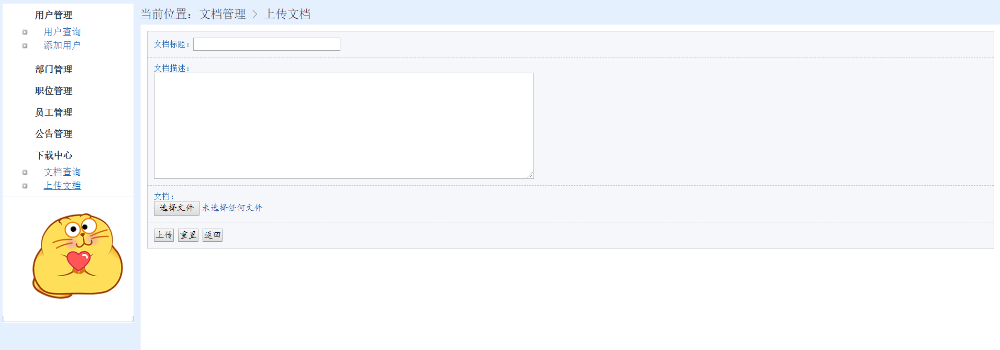
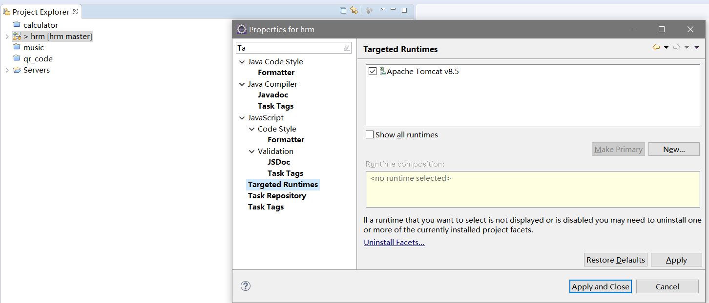

# 1. 人事管理系统
## 1.1. 模块
- 用户管理
- 部门管理
- 职位管理
- 员工管理
- 公告管理
- 下载中心
## 1.2. 项目结构图

# 2. 环境
win10+eclipse2019.08+tomcat8.5+Sql Server 2012+JDK1.8
# 3. 使用到的框架
- 后台
SSM框架(Spring + Mybatis+ Spring MVC)
- 前端
Jsp+Jquery+CSS+El表达式
# 4. 使用指南
- 先从GitHub 上git clone下来,导入hrm.sql数据库文件
- 在eclipse中导入,引入lib下的jar包(不然会报错,缺少依赖)
- 
- 发布到tomcat上面(默认访问:http://localhost:8080/HrmPro/)
# 5. 运行效果

# 6. 注意事项
- 用的是tomcat8.5和jdk1.8,如果不是这个版本,请右键项目,选最后一项,如图,这里选上就可以了
- 

# 7. 鸣谢
感谢《Spring+MyBatis企业应用实战》这本优秀的书籍的案例